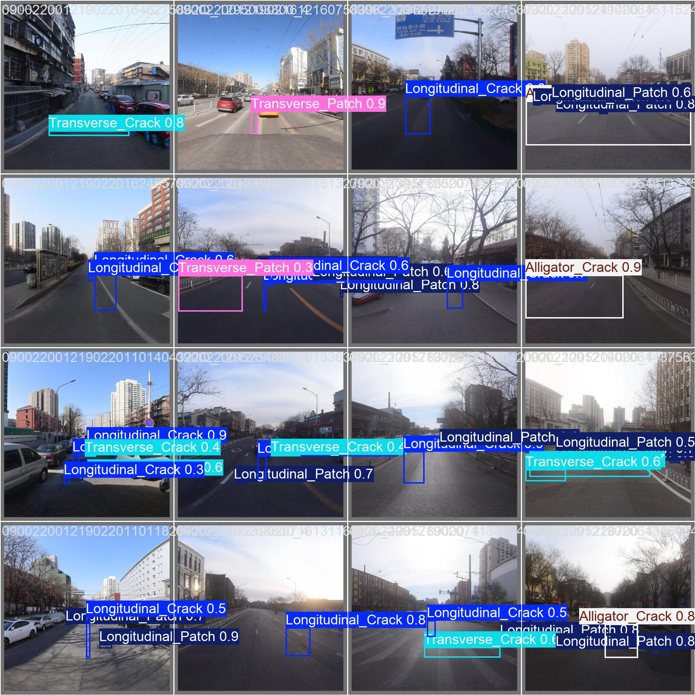
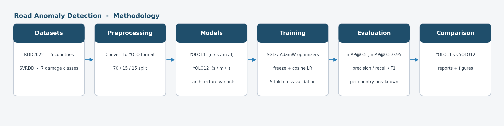
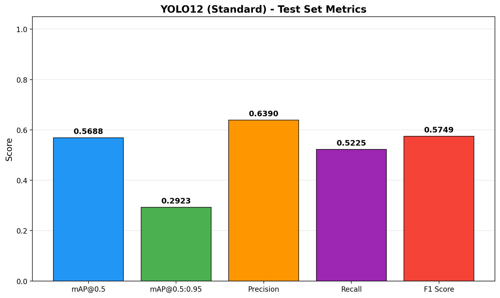
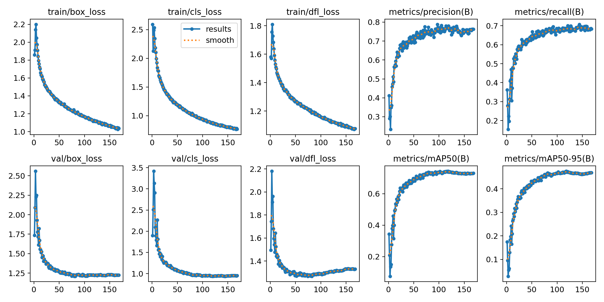
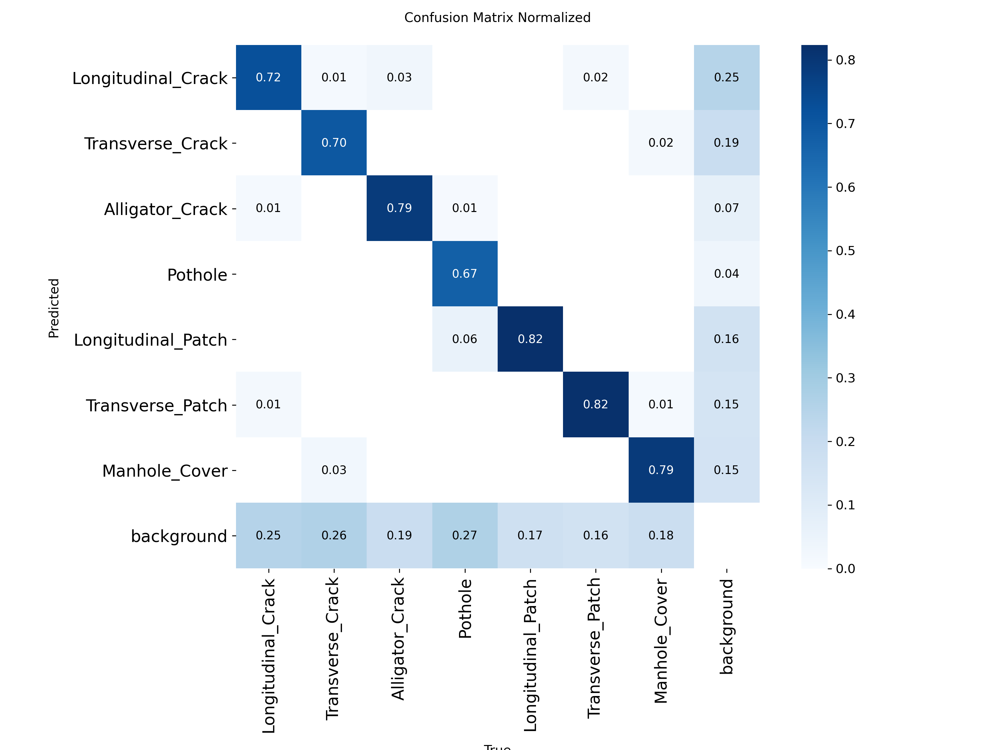
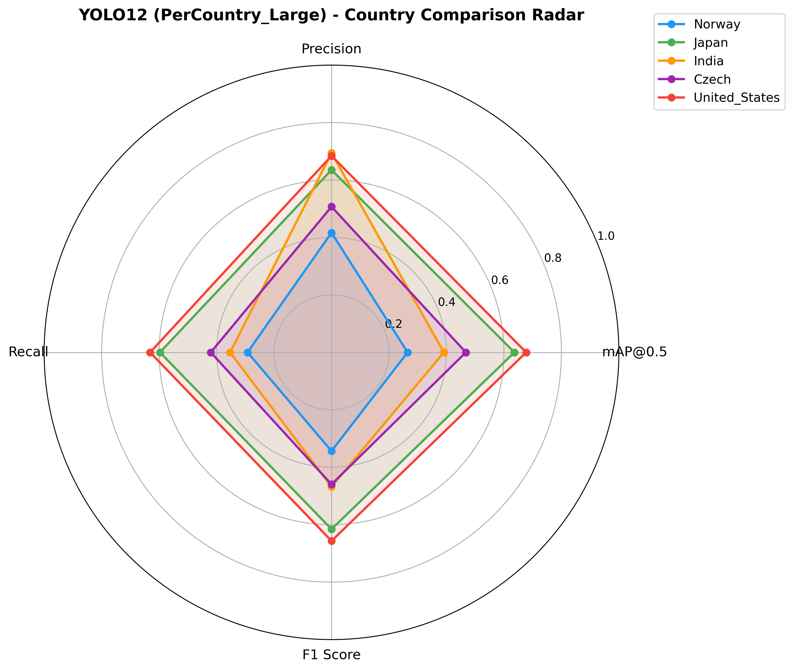
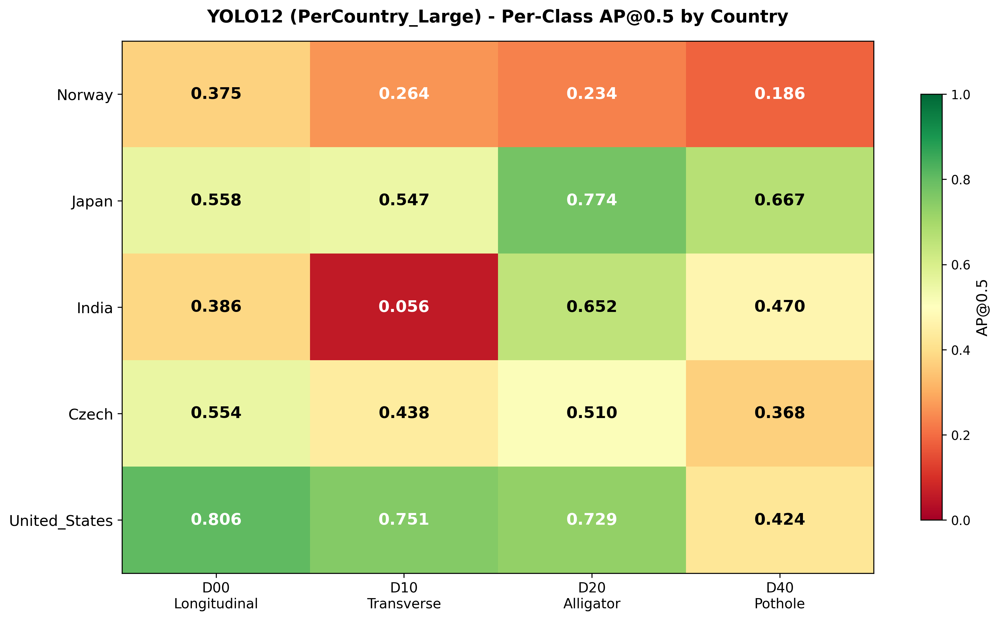

# Road Anomaly Detection: YOLOv11 vs YOLOv12

A comparative study of two modern object detectors, **YOLOv11** and **YOLOv12**, applied to automatic road damage detection. The project trains and evaluates both families across two public datasets, several model sizes, and a set of architecture modifications, then reports where each model wins and by how much.

This work was carried out as a Master 2 final-year project (Projet de Fin d'Études).



*Predictions from YOLOv11-Large on the SVRDD test set: longitudinal and transverse cracks, alligator cracks, potholes, patches and manhole covers detected on real street-level imagery.*

---

## Overview

Road surface damage such as cracks and potholes is expensive to survey manually. Detecting it automatically from vehicle-mounted cameras is a well-suited task for single-stage detectors. The question this project answers is a practical one: given the same data and the same training budget, does the newer YOLOv12 actually outperform YOLOv11 on road damage, and if so, where?

To answer it fairly, both models are trained under identical conditions and compared on the same held-out test sets, with a per-country breakdown and a second, larger dataset to check that the conclusions hold.



---

## Datasets

The study uses two independent, publicly available road damage datasets.

**RDD2022** — the multi-national Road Damage Detection dataset. This project uses five countries (Norway, Japan, India, Czech Republic, United States) and four damage classes:

| Code | Damage type          |
|------|----------------------|
| D00  | Longitudinal crack   |
| D10  | Transverse crack     |
| D20  | Alligator crack      |
| D40  | Pothole              |

**SVRDD** — the Street-View Road Damage Dataset: 8,000 densely annotated 1024×1024 images across seven classes (the four crack/pothole types above plus longitudinal patch, transverse patch, and manhole cover). It serves as a second, harder benchmark to confirm the comparison generalises.

Both datasets are converted to the YOLO annotation format by `setup_dataset.py` and split 70 / 15 / 15 for train / validation / test.

---

## What the Project Does

- Trains **YOLOv11** and **YOLOv12** from the `n`, `s`, `m`, `l` and `x` size families
- Runs two training regimes for a fair comparison: a **Standard** SGD baseline and an **improved** run with a frozen backbone and cosine-annealed learning rate
- Evaluates **per country**, so per-region strengths and weaknesses are visible rather than averaged away
- Explores four architecture modifications on YOLOv12-Large — a **P2 detection head**, a **wider FPN neck**, a **deeper A2C2f backbone**, and their combinations
- Adds a **two-stage transfer** pipeline and a **k-fold cross-validation** post-learning stage on extra high-resolution imagery
- Generates a full set of figures and reports for every run: metric summaries, PR/F1 curves, confusion matrices, per-country radar and heatmap charts, and Excel exports

---

## Model Variants

Beyond the stock models, the study evaluates several architecture edits on the YOLOv12-Large backbone. Each is defined by a custom model YAML under `models/`.

| Variant            | Modification                                                        |
|--------------------|---------------------------------------------------------------------|
| Baseline           | Stock YOLOv12-Large                                                  |
| P2 Head            | Extra detection head at stride 4 for small-object recall            |
| Wider Neck         | FPN channels widened (256→384, 512→768)                             |
| Deep A2C2f         | Backbone A2C2f blocks increased from 4 to 6                         |
| P2 + Wider Neck    | P2 head combined with the wider neck                                |
| P2 + Deep A2C2f    | P2 head combined with the deeper backbone                           |
| Two-Stage Transfer | Train the P2 variant, then fine-tune the P2 + Wider Neck from it     |

---

## Results

### YOLOv11 vs YOLOv12 on RDD2022

Both `s`-size models trained under identical settings on the five-country RDD2022 test set. The two are remarkably close; YOLOv12 holds a slight edge on mAP and precision, at the cost of noticeably longer training time.

| Model     | Regime            | mAP@0.5 | mAP@0.5:0.95 | Precision | Recall | F1     | Train time |
|-----------|-------------------|:-------:|:------------:|:---------:|:------:|:------:|:----------:|
| YOLOv11-s | Standard          | 0.5683  | 0.2881       | 0.6267    | 0.5238 | 0.5707 | 5h 03m     |
| YOLOv12-s | Standard          | 0.5688  | 0.2923       | 0.6390    | 0.5225 | 0.5749 | 6h 38m     |
| YOLOv11-s | Freeze + Cosine   | 0.4766  | 0.2295       | 0.5398    | 0.4710 | 0.5031 | 3h 14m     |
| YOLOv12-s | Freeze + Cosine   | 0.4777  | 0.2276       | 0.5460    | 0.4692 | 0.5047 | 4h 55m     |

<p align="center">
  
  
</p>

### Training Behaviour

Loss and metric curves over the course of training, showing the box, classification and DFL losses converging alongside rising precision, recall and mAP.



### Where the Errors Are

The normalised confusion matrix on the SVRDD test set. The diagonal is strong across all seven classes; most residual error is objects lost to background rather than confused between damage types.

<p align="center">
  
</p>

### Per-Country Breakdown

Performance is far from uniform across countries. A single averaged mAP hides this, so every run is also evaluated on each country separately. The United States and Japan subsets are the easiest; India's transverse cracks are consistently the hardest case.

<p align="center">
  
  
</p>

---

## Installation

Requires **Python 3.10+** and, for any realistic training, a CUDA-capable GPU.

1. Create and activate a virtual environment:

```bash
python -m venv venv
venv\Scripts\activate
```

2. Install PyTorch with CUDA (adjust the CUDA version for your machine):

```bash
pip install torch torchvision --index-url https://download.pytorch.org/whl/cu121
```

3. Install the remaining dependencies:

```bash
pip install -r requirements.txt
```

---

## Preparing the Data

1. Download **RDD2022** from the [official release](https://figshare.com/articles/dataset/RDD2022_-_The_multi-national_Road_Damage_Dataset_released_through_CRDDC2022/21431547) and extract it.
2. Run the conversion script and point it at the extracted folder when prompted:

```bash
python setup_dataset.py
```

This converts the annotations to YOLO format, filters to the five target countries, and writes the train / validation / test splits together with a `data.yaml`. The SVRDD dataset can be downloaded from [Zenodo](https://zenodo.org/records/10100129) and extracted into `SVRDD_dataset/`.

---

## Usage

Everything runs from a single interactive menu:

```bash
python main.py
```

The menu is organised by experiment type:

- **Standard training** — YOLOv11 / YOLOv12 baselines, with and without the freeze + cosine-LR regime
- **Per-country testing** — train on all countries, evaluate on each one separately
- **Optimized runs** — XLarge models at 1280 px with strong augmentation and test-time augmentation
- **SVRDD** — the same models on the second dataset
- **Ablation study** — the YOLOv12-Large architecture variants
- **Post-learning** — k-fold cross-validation with additional high-resolution images
- **Dataset info** — class distribution and split statistics

Each run writes a timestamped folder under `results/` containing the weights, figures, and a text and Excel report.

---

## Project Structure

```
road-anomaly-detection-yolov11-vs-yolov12/
├── main.py                 # Interactive menu and experiment entry points
├── setup_dataset.py        # RDD2022 / SVRDD to YOLO-format conversion
├── config.py               # Datasets, training regimes, and model configs
├── requirements.txt        # Python dependencies
│
├── src/
│   ├── train.py            # All training pipelines
│   ├── evaluate.py         # Test-set evaluation and metrics
│   ├── compare.py          # YOLOv11 vs YOLOv12 comparison
│   ├── percountry.py       # Per-country evaluation and charts
│   ├── predict.py          # Inference on new images
│   ├── dataset_info.py     # Dataset statistics
│   ├── report_generator.py # Figure and report generation
│   └── utils.py            # Shared helpers
│
├── models/                 # Custom YOLOv12-L architecture YAMLs + best weights
├── data/                   # Dataset location (populated by setup_dataset.py)
└── assets/                 # Figures used in this README
```

---

## Training Environment

All models were trained on a single desktop workstation.

| Component | Specification                           |
|-----------|-----------------------------------------|
| CPU       | AMD Ryzen 7 7800X3D                      |
| GPU       | NVIDIA GeForce RTX 4070 Ti SUPER (16 GB) |
| RAM       | 64 GB DDR5                               |

The `s`-size models take roughly five to seven hours per 100-epoch run at 640 px; the XLarge 1280 px configurations are considerably heavier and are intended for higher-VRAM hardware.

---

## References

- [RDD2022: The multi-national Road Damage Dataset](https://figshare.com/articles/dataset/RDD2022_-_The_multi-national_Road_Damage_Dataset_released_through_CRDDC2022/21431547) — released through CRDDC2022
- [SVRDD: Street-View Road Damage Dataset](https://zenodo.org/records/10100129)
- [Ultralytics YOLO documentation](https://docs.ultralytics.com/)

---

## License

Released under the MIT License. See [LICENSE](LICENSE) for details.
